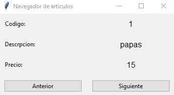

### urllib, JSON y Tkinter

Crearemos un programa que obtenga los datos retornados por el archivo PHP **retornararticulos.php** y los transforme en formato JSON para interpretarlos. El programa deberá incluir una interfaz visual para recorrer el listado de articulos similar a esta imagen:

