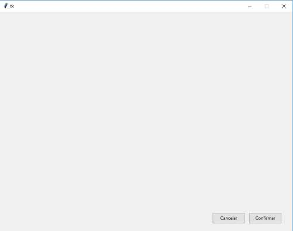

## Administrador de diseño PLACE
Disponer dos botones en la parte inferior derecha de la ventana utilizando el Layout Manager de tipo Place. El ancho y alto de la ventana debe ser de 800 por 600 píxeles.
La representación visual debe ser:

