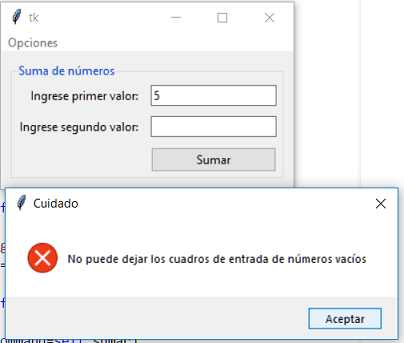
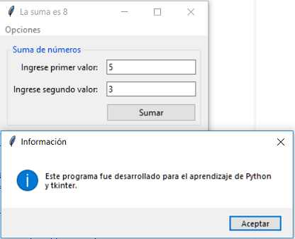

## Problema de ejemplo 69_1
Confeccionar una aplicación que permita ingresar dos valores enteros y al presionar un botón nos muestre la suma en el título de la ventana. Si el operador no ingresa en alguno de los dos controles Entry datos informar mediante un diálogo el error que se está cometiendo.
Agregar además un menú de opciones que al ser seleccionado nos muestre información del programa.

La representación visual cuando se presiona el botón "sumar" y no se ingresa alguno de los dos números debe ser:

La representación visual cuando se abre el diálogo que informa sobre el programa desde el menú de opciones es:

