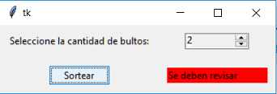

## Implementando Spinbox
En una aduana hay una máquina que sortea las personas cuyo equipaje serán revisados.
La persona selecciona la cantidad de bultos (hacer dicha selección mediante un Spinbox)

Luego se presiona el botón sortear y aparece al lado de este botón una Label de color rojo o verde (En caso de ser rojo se revisa su equipaje, en caso de ser verde, no se revisa)
Para el sorteo generar un valor aleatorio entre 1 y 3. Si se genera un 1 se revisa, si se genera un 2 o 3 no se revisa, mostrar un mensaje de error si el Spinbox tiene un cero.

La interfaz visual debe ser similar a esta:

