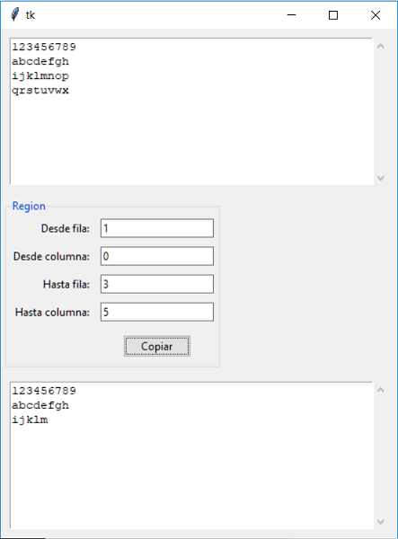

## Practicando ScrolledText
Confeccionar un programa que contenga dos controles de tipo ScrolledText. En el primero ingresamos por teclado cualquier texto. Mediante 4 controles de tipo Entry indicar desde que fila y columna hasta que fila y columna extraer caracteres del primer ScrolledText y copiarlos al segundo ScrolledText cuando se presione un botón.

La interfaz visual debe ser similar a esta:

