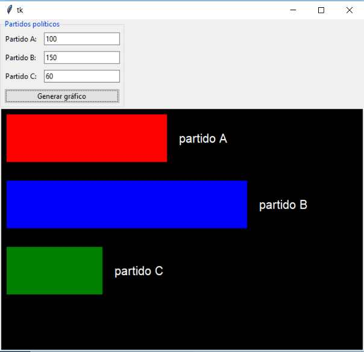

## Canvas tipo rectangle
Crear una aplicación que solicite el ingreso de tres valores por teclado que representan las cantidades de votos obtenidas por tres partidos políticos. Luego mostrar un gráfico de barras horizontales.

La interfaz visual debe ser similar a esta:

