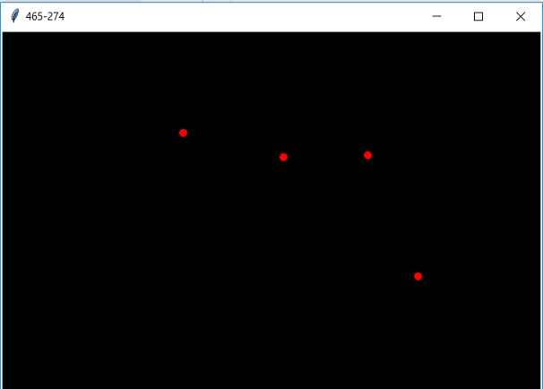

## Capturar evento del raton parte I
Confeccionar un programa que cree un objeto de la clase Canvas y nos muestre en el título de la ventana la coordenada actual del mouse dentro del control Canvas y al presionar el botón izquierdo del mouse se dibuje un círculo en dicha posición.

La interfaz visual debe ser similar a esta:

