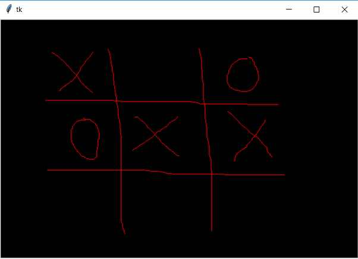

## Capturar eventos del raton Parte II
Confeccionar un programa que cree un objeto de la clase Canvas y nos permita dibujar a mano alzada dentro del mismo.

La interfaz visual debe ser similar a esta luego de dibujar unos trazos:

