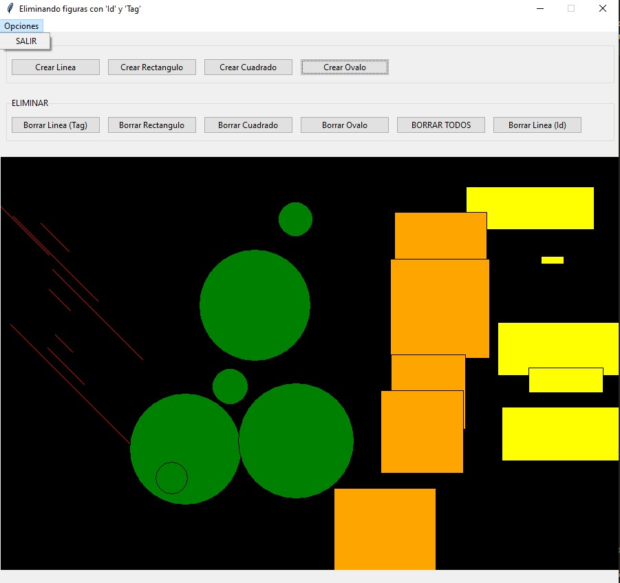

## Eliminar figuras con 'Id' y 'Tag'
Confeccionar un programa que cree un objeto de la clase Canvas y luego dibuje una línea, un réctángulo y un óvalo, almacenar el Id de cada dibujo en un atributo.
Crear también 3 cuadrados y definir el parámetro tag con el mismo valor para cada uno de ellos.

Mediante cinco botones permitir: borrar la línea, borrar el rectángulo, borrar el óvalo, borrar todos los cuadrados y borrar todas las figuras contenidas en el objeto Canvas.
**(EXTRA)** Se incluye una seccion para elegir que figura se desea crear y al pulsar click izquierdo en el lienzo se crea la figura de medidas aleatorias.
Ademas se añade un menu con la opcion de salir.

La interfaz visual debe ser similar a esta:

