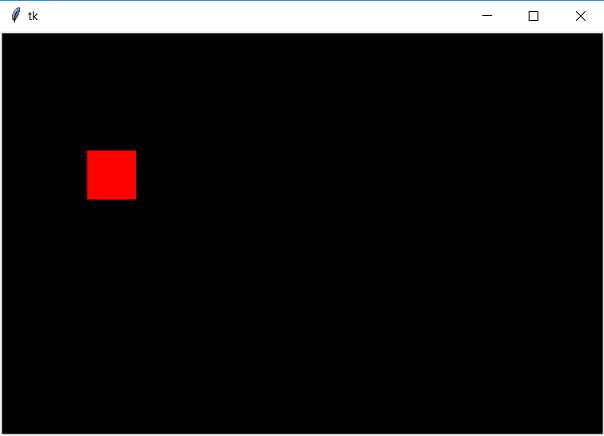

## Mover figuras con KeyPress
Confeccionar un programa que que muestre un cuadrado dentro de un Canvas. Cuando se presione alguna de las teclas de flecha proceder a desplazar la figura 4 píxeles teniendo en cuenta la dirección de la tecla de flecha presionada.

La interfaz visual debe ser similar a esta:

