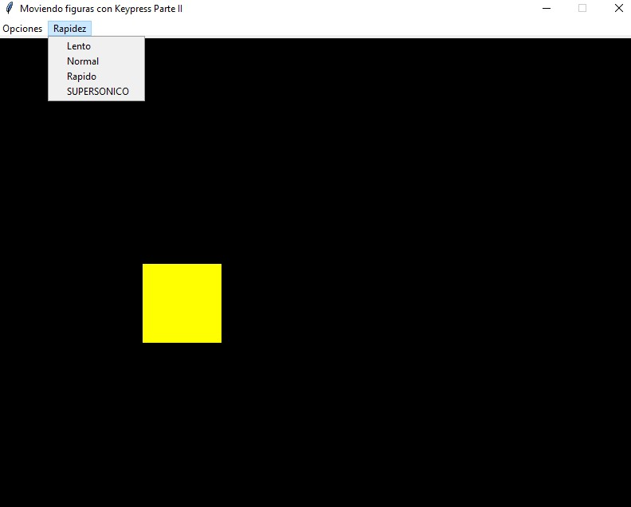

## Mover figuras con KeyPress y evitar desbordamiento
Modificar el problema que desplaza un cuadrado con las teclas de flechas de tal modo que la figura no pueda salir del espacio definido para el Canvas.
Para saber la posición actual de una figura la clase Canvas cuenta con el método 'coords':
**x1, y1, x2, y2 = self.canvas1.coords(self.cuadrado)**

