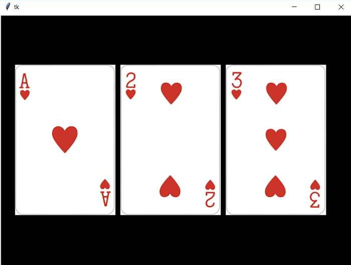

## Mostrar imágenes con tkinter
Se cuenta con tres archivos de tipo png con las imágenes de distintas cartas. Mostrarlas a cada una dentro de una componente de tipo Canvas.

La interfaz visual debe ser similar a esta:

