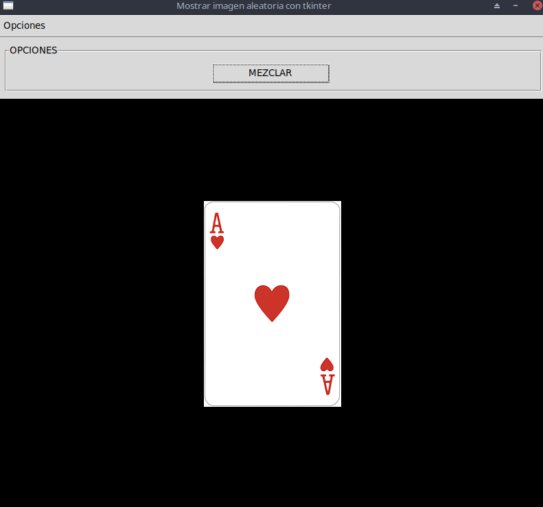

## Mostrar imagen aleatoria con tkinter
Disponer un botón y mostrar al azar una de las tres cartas del problema anterior. Cada vez que se presione el botón generar un valor aleatorio y a partir de dicho valor mostrar una carta.
**EXTRA** Se ha agregado un menu con la opcion de salir.

