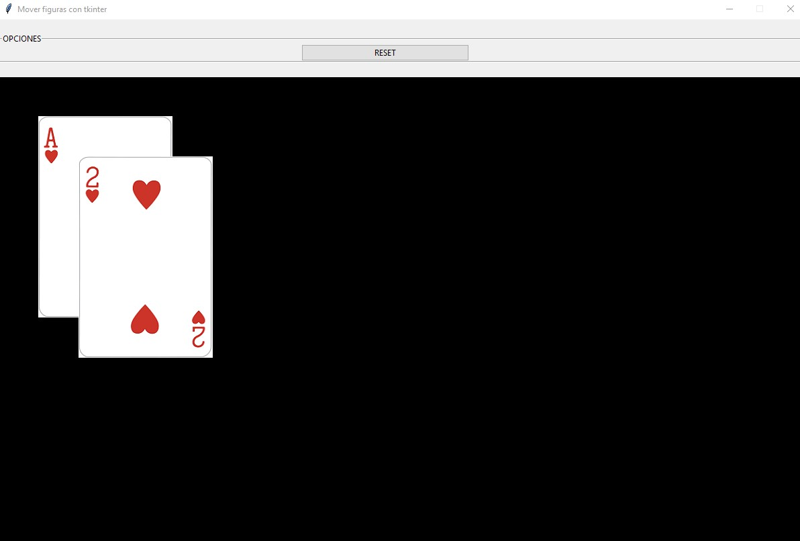

## Mover figuras con tkinter
Se cuenta con dos archivos de tipo png con las imágenes de distintas cartas. Mostrarlas a cada una dentro de un componente de tipo Canvas y permitir moverlas dentro del control mediante el mouse.

**(EXTRA)** Se a agregado la posibilidad de refrescar la ubicación de las figuras a la ubicación inicial.

La interfaz visual debe ser similar a esta y permitir mover las imágenes:

