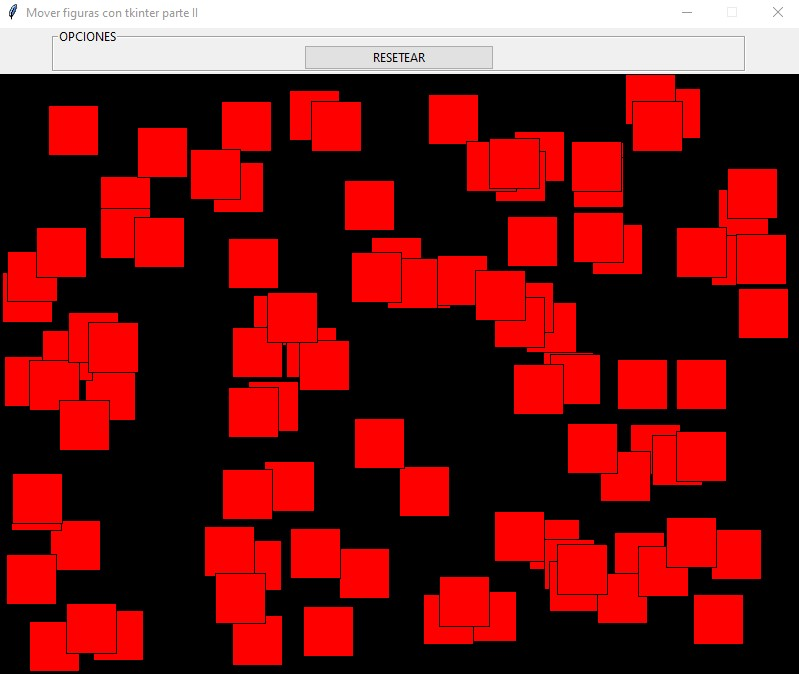

## Crear 100 cuadrados con tkinter y poderlos mover individualmente
Crear 100 cuadrados de color rojo y disponerlos en el control Canvas en posiciones aleatorias. Permitir desplazar con el mouse cualquiera de los cuadrados.

