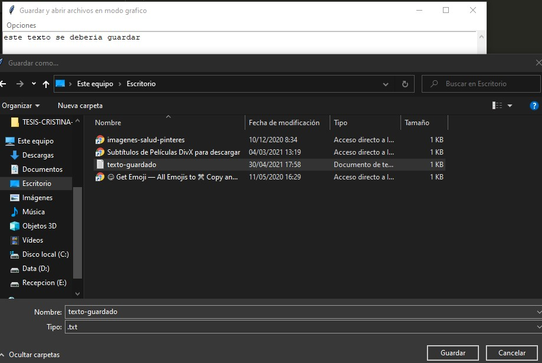

## Abrir y guardar archivos con interfaz visual tkinter

Confeccionar una interfaz visual que contenga un menú de opciones que permitan "Guardar archivo", "Recuperar archivo" y "Salir del programa".
En la ventana principal debe aparecer un control de tipo 'scrolledtext' donde el operador pueda escribir un texto para luego grabarlo en un archivo de texto. También el control 'scrolledtext' debe cargarse con el contenido de un archivo existente en el disco duro.

**(EXTRA)** Se ha añadido la opcion para escribir automaticamente la extension *'.txt'* en caso que al usuario se le olvide ponerla

