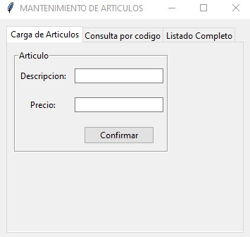

## Proyecto acceso a MySQL desde la interfaz Tkinter

### Parte I
Desarrollar una aplicación visual con la librería tkinter que permita implementar los algoritmos de carga de artículos, consulta por código y listado completo.

Seguiremos trabajando con la tabla 'articulos' que creamos en el concepto anterior.

Para trabajar un poco más ordenado en la resolución de este problema lo dividiremos en dos módulos 'formularioarticulos.py' y 'articulos.py'.

Las interfaz visual para la carga debe ser:

Las interfaz visual para la consulta:

Y finalmente la interfaz para el listado completo:

### Parte II
Agregar dos pestañas al programa de administración de artículos que permitan borrar un artículo ingresando su código y otra opción que permita consultar y modificar la descripción y precio de un artículo.

La interfaces visuales a implementar son:

