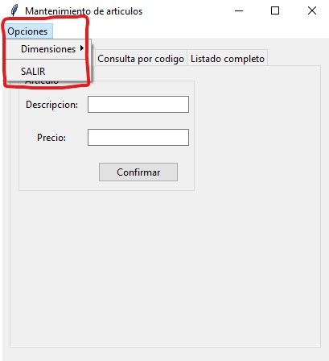

## Aplicacion Tkinter con base de datos SQLite

### Parte I

Desarrollar una aplicación visual con la librería tkinter que permita implementar los algoritmos de carga de artículos, consulta por código y listado completo.

Trabajaremos con la base de datos 'bd1.db' que creamos en el concepto anterior.

**(EXTRA)** Incluir un menu de opciones para salir del programa y redimensionar la ventana.

Las interfaz visual para la carga debe ser:

Imagen del menu:

Imagen de la sección de carga de artículo nuevo:

Imagen de la seccion de búsqueda del artículo por su código:

Imagen de la seccion que lista todos los artículos:

### Parte II

Agregar dos pestañas al programa de administración de artículos que permitan borrar un artículo ingresando su código y otra opción que permita consultar y modificar la descripción y precio de un artículo.

La interfaz visual para la eliminación de un articulo debe ser:

Imagen de la sección para modificar un articulo:

