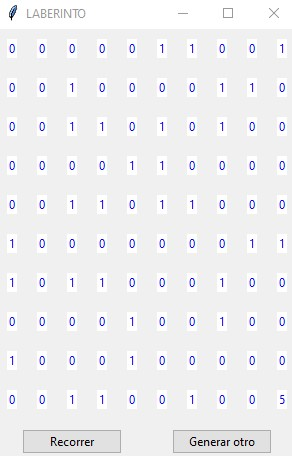
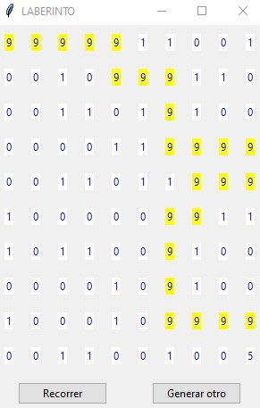

## Problema donde es recomendable emplear Recursividad. Parte I

Desarrollar un programa que permita recorrer un laberinto e indique si tiene salida o no empleando la librería tkinter.
Para resolver este problema al laberinto lo representaremos con una lista de 10 elementos de tipo lista que en casa una hay 10 Label.
El valor:

0	Representa pasillo
1	Representa pared
9	Persona
5	Salida
A la salida ubicarla en la componente de la fila 9 y columna 9.
La persona comienza a recorrer el laberinto en la fila 0 y columna 0.
Los ceros y unos disponerlos en forma aleatoria.

