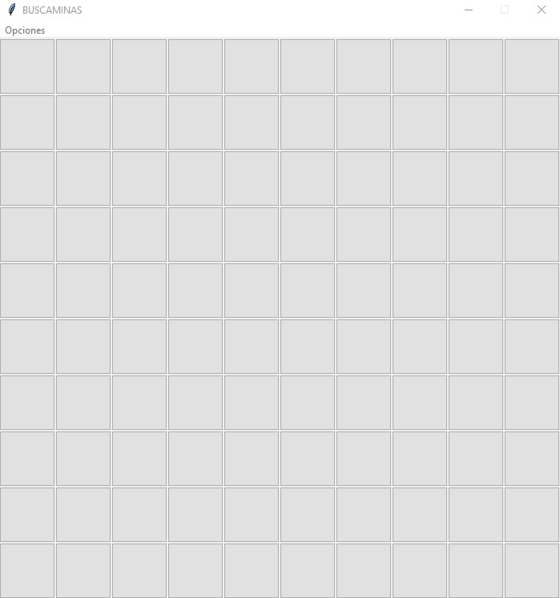
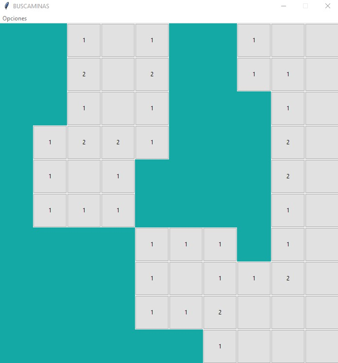
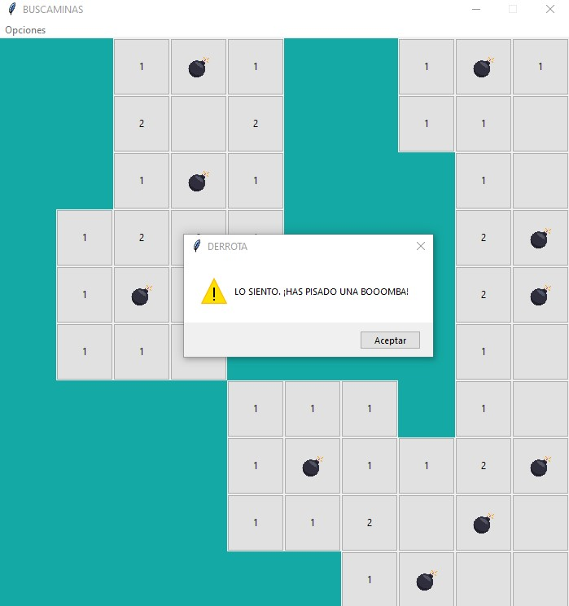
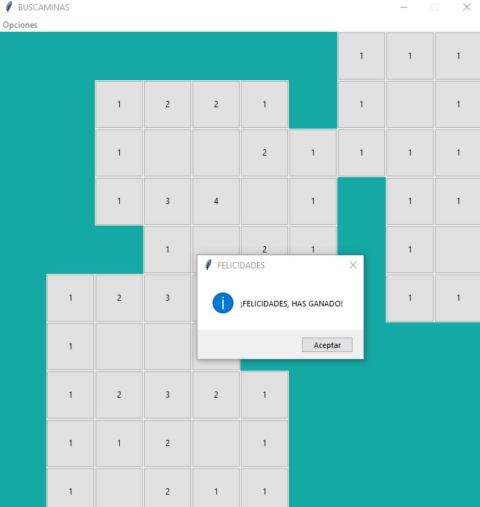

## Crear "El Buscaminas" usando la recursividad y el módulo Tkinter

Desarrollar el juego del Buscaminas. Definir una lista de 10 elementos de tipo lista y en estas listas internas almacenar las referencias a botones.

El juego consiste en destapar todas las casillas que no tiene bombas. Si se presiona la casilla que tiene bomba finaliza el juego. En las casillas que están en el perímetro de una bomba aparece un número que indica la cantidad de bombas a su alrededor. Por ejemplo si una casilla tiene el 2 significa que de las 8 casillas a su alrededor hay 2 bombas.

Si se selecciona una casilla que no tiene bombas a su alrededor se libera esta y todas las que se encuentran próximas a ella.

Permitir volver a jugar mediante un menú de opciones.

Cuando se inicia el juego debe aparecer el tablero con las 100 casillas:

Imagen mientras se está jugando:

Si perdemos:

Si ganamos:

