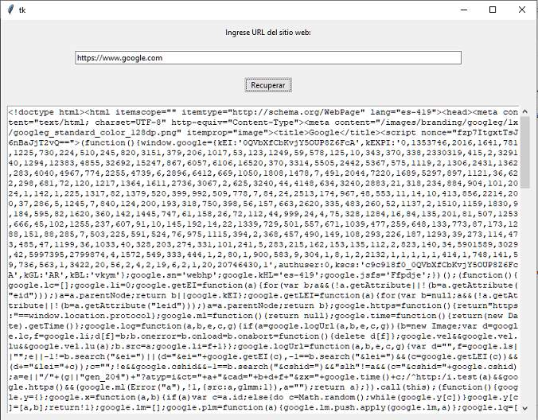

## Capturar codigo fuente de url y mostrarlos en un ScrolledText (Tkinter y urllib)

Confeccionar una aplicación visual con tkinter que permita ingresar en un control de tipo 'Entry' la URL de un sitio web y al presionar un botón recuperar los datos y mostrarlos en un control de tipo 'ScrolledText':

